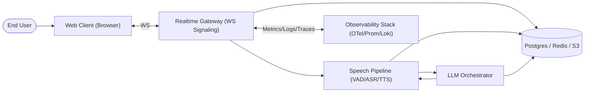
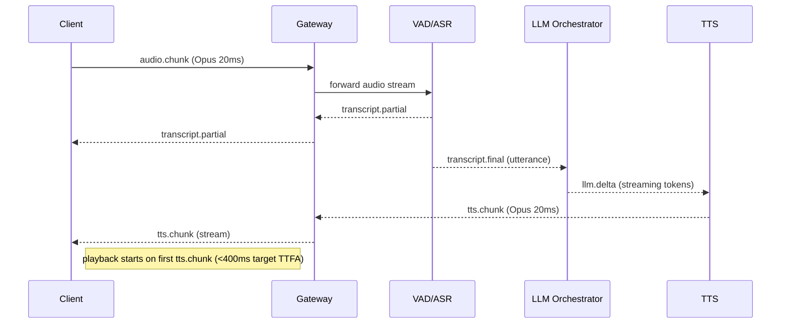

# Voice Chatbot Architecture (MVP)

System context and container-level C4-style diagrams for the low-latency voice chatbot MVP (WebSocket-first, Opus 20ms, server-side VAD/ASR/LLM/TTS pipeline).

## One-Page Summary
- Transport: WebSocket-first for control + media; Opus 48kHz mono 20ms frames; binary framing with small headers. WebRTC media is a later optimization.
- Pipeline: Browser audio → Gateway → VAD/ASR (streaming partials) → LLM orchestrator (streaming tokens) → streaming TTS → audio chunks back. Everything streams; overlap ASR partials → LLM → TTS to hit <400ms TTFA.
- VAD: primary on server (consistent tuning, device-agnostic); optional client gate to skip clear silence.
- Barge-in: new upstream audio sends `barge` event; gateway cancels in-flight TTS/LLM, flushes playback buffers.
- Data plane: Redis for session FSM/rate limits; Postgres for sessions/turns/costs/transcripts; S3 for optional recordings; bus (NATS/Kafka/SQS) for async/offline.
- Observability: OTel traces + Prom metrics + structured logs with tenant/session IDs; per-tenant cost/latency accounting.

## System Context


## Container / Component (MVP)
```mermaid
flowchart TD
  subgraph Client [Client]
    mic["Mic Capture (AudioWorklet, Opus 20ms)"]
    wsClient["WS Client SDK (Auth + Events)"]
    player["Playback Engine (WebAudio, minimal buffer)"]
  end

  subgraph Edge [Edge/Gateway (Node/TS)]
    wsServer["WS Server (Fastify + ws/socket.io)"]
    auth["Auth & Rate Limit (JWT + Redis bucket)"]
    fsm["Session FSM (Redis-backed)"]
    router["Stream Router (gRPC/NATS)"]
  end

  subgraph Speech [Speech Services]
    vad["VAD/Endpointing (Rust/Go)"]
    asr["Streaming ASR (Vendor/API)"]
    tts["Streaming TTS (Vendor/API)"]
  end

  subgraph LLM [LLM Layer]
    orchestrator["LLM Orchestrator (Node/TS)"]
    models["LLM Providers (Streaming tokens)"]
  end

  subgraph Data [Data Stores]
    redis[(Redis: state, rate limits)]
    pg[(Postgres: sessions, turns, costs)]
    s3[(S3: recordings/logs)]
    bus[(Message Bus: NATS/Kafka/SQS)]
  end

  subgraph Obs [Observability]
    otel["OTel Collector"]
    prom["Prom/Grafana"]
    logs["Loki/ELK"]
  end

  mic --> wsClient --> wsServer
  player <-- wsServer
  wsServer --> auth --> redis
  wsServer --> fsm --> redis
  wsServer --> router
  router --> vad --> asr --> orchestrator
  orchestrator --> models
  orchestrator --> tts
  tts --> wsServer
  asr --> wsServer
  wsServer --> pg
  wsServer --> s3
  wsServer --> bus
  bus --> s3
  wsServer -. metrics/logs .-> otel
  vad -.-> otel
  asr -.-> otel
  orchestrator -.-> otel
  tts -.-> otel
  otel --> prom
  otel --> logs
```

## Sequence Diagrams
### Session Start / Auth / Capability Negotiation
```mermaid
sequenceDiagram
  participant C as Client
  participant G as Gateway (WS)
  participant R as Redis
  participant P as Postgres
  C->>G: session.start {jwt, tenant, caps}
  G->>R: rate-limit check; session init
  G->>P: upsert session row
  G-->>C: session.ack {sessionId, codecs, limits}
  G-->>C: heartbeat/ready
```

### Streaming Path (Audio→ASR→LLM→TTS→Playback)


### Error Handling (Timeouts/Fallbacks)
```mermaid
sequenceDiagram
  participant C as Client
  participant G as Gateway
  participant V as VAD/ASR
  participant L as LLM
  participant T as TTS
  V--x G: timeout/no partial (e.g., 300ms)
  G-->>C: error {code:"asr_timeout"}; prompt retry or text mode
  L--x G: timeout first-token (e.g., 800ms)
  G-->>C: error {code:"llm_timeout"}; optional canned short reply
  T--x G: timeout first-chunk (e.g., 300ms)
  G-->>C: error {code:"tts_timeout"}; fallback to text transcript
  Note left of G: cancel outstanding streams; record metrics/logs
```

## WebSocket API & Contracts
- Event names (JSON unless noted):
  - `session.start`: `{jwt, tenantId, appId?, device:{ua,latencyHint?}, mode:"ptt"|"vad", codecs:["opus/48000/20"], locale, vadClient?:bool}`
  - `session.ack`: `{sessionId, heartbeatMs, maxBitrate, serverCodecs:["opus/48000/20"], limits:{maxUtteranceMs, timeouts:{asrMs,llmMs,ttsMs}}}`
  - `audio.chunk` (binary): see framing below.
  - `audio.eos`: `{reason:"ptt_release"|"client_vad"|"silence_timeout"}`
  - `transcript.partial`: `{sessionId, utteranceId, text, stability, avgLogprob?}`
  - `transcript.final`: `{sessionId, utteranceId, text, startMs, endMs}`
  - `llm.delta`: `{sessionId, turnId, text, isFinal?:bool, tokenLogprob?}`
  - `tts.chunk` (binary): see framing below.
  - `barge`: `{activeTurnId}` (client→server to cancel playback).
  - `session.end`: `{reason, stats:{latencyMs,cost}}`
  - `error`: `{code, message, retryable?, component}`

### Binary Framing for Audio (WS)
- Uplink `audio.chunk`:
  - Header (5 bytes):
    - byte0: magic `0xA1`
    - byte1: flags (bit0=end-of-utterance, bit1=reserved)
    - byte2-3: seq (u16 big-endian)
    - byte4: durationMs (uint, expect 20)
  - Payload: Opus frame 20ms @48kHz mono.
- Downlink `tts.chunk`:
  - Header (5 bytes):
    - byte0: magic `0xB1`
    - byte1: flags (bit0=end-of-utterance)
    - byte2-3: seq (u16 big-endian)
    - byte4: durationMs
  - Payload: Opus 20ms @48kHz mono.

## Latency Budget (TTFA <400ms)
| Segment                       | Target (ms) | Tactics to keep low                                                                 |
|-------------------------------|-------------|--------------------------------------------------------------------------------------|
| Client capture + encode       | 25–40       | AudioWorklet low buffer; pre-warm Opus; 20ms frames                                  |
| Network RTT (same region)     | 40–60       | Regional affinity; TLS resume; WS keepalive                                          |
| VAD detection window          | 60–80       | Short window + 100ms hangover; stream immediately; tuned thresholds                  |
| ASR partial decode            | 80–120      | Streaming ASR; warm pool; small beam; GPU/CPU autoscale                              |
| LLM first token               | 80–120      | Warm routers; short system prompt; speculative decoding; prompt cache                |
| TTS first audio chunk         | 80–120      | Streaming TTS; preloaded voice; send on partial text; cache prosody                  |
| Return + playback buffer      | 30–50       | 40–60ms jitter buffer; immediate play on first chunk; congestion control             |
| Overlapped total              | ~330–370    | Parallelize ASR→LLM→TTS; partial commits; no waits for full text                     |

## Frontend Plan
- Capture: `getUserMedia` with EC/NS/AGC; AudioWorkletNode to pull 20ms PCM; client-side Opus (wasm) to keep uplink small.
- Streaming: WS binary frames per 20ms with header; `audio.eos` on PTT release or client VAD end; heartbeats.
- Playback: WebAudio + wasm Opus decode; 2–3 frame buffer (~40–60ms); support `barge` by clearing buffer and pausing.
- UI states: connecting, listening (PTT/VAD), thinking, speaking, error/retry; show partial transcripts.
- Error UX: toast + retry; degrade to text-only if TTS fails; display timeouts.

## Backend Plan
- Gateway: Node/TS (Fastify + ws/socket.io); JWT auth; per-tenant rate limits (Redis leaky bucket); session heartbeats.
- Pipeline: per-session ring buffers; forward audio to VAD/ASR; forward partials immediately; commit utterance on endpoint; cancel on `barge`.
- VAD/ASR: Rust/Go VAD (WebRTC VAD/Silero); streaming ASR vendor (low-latency tier).
- LLM Orchestrator: Node/TS; model routing per tenant; streaming tokens; truncation; speculative decoding optional.
- TTS: streaming vendor (Opus out); warm voices; start on first tokens.
- State: Redis FSM (connecting/listening/thinking/speaking); transient turn buffers; pub/sub for cancel signals.
- Persistence: Postgres tables for tenants, sessions, turns, events, costs, latencies, transcripts; write async when possible.
- Async/Offline: bus (NATS/Kafka/SQS) for recordings export/analytics; S3 for optional storage.
- Observability: OTel traces; Prom metrics (TTFA, ASR partial latency, LLM first token, TTS first chunk, barge count); structured logs.

## Security & Compliance Checklist
- Auth: JWT/OIDC with tenant claim; WS over TLS; key rotation.
- Limits/abuse: Redis rate limits; payload caps; max concurrent sessions; profanity/abuse filters optional.
- PII: default no audio retention; redact emails/numbers in transcripts before DB; short TTL in Redis; S3 opt-in with SSE.
- Prompt injection (voice): clamp system prompt; strip SSML escapes; allowlist SSML tags; optional classifier.
- Secrets: Vault/Param Store; no secrets in logs; per-tenant keys isolated.
- Audit: Postgres audit table (session start/end/errors/admin actions); log admin access; encryption at rest + in transit.

## 2-Week MVP Scope
- Ship: WS media + control; Opus 20ms; server VAD; streaming ASR+LLM+TTS; barge-in cancel; Redis FSM + rate limits; Postgres minimal schema; metrics for TTFA; basic error fallbacks to text.
- Defer: WebRTC media; advanced PII pipeline; multi-region; SSML prosody tuning; offline analytics export; multi-voice; mobile app.
- Tests: unit (WS framing, Redis rate limiter, FSM transitions); integration (happy path, barge-in, timeouts for ASR/LLM/TTS); load (200→500 sessions); latency (loopback TTFA breakdown).
